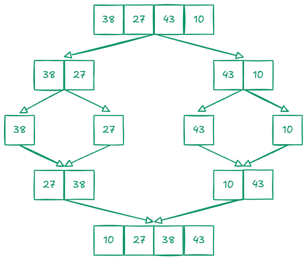
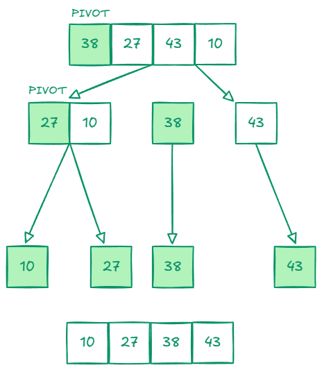
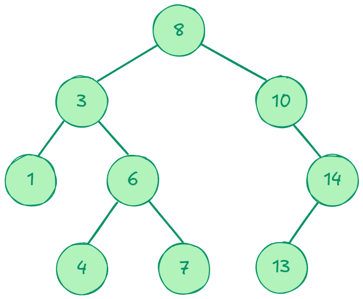

# 📂 Divide and Conquer Algorithms

### Visual Overview

<table>
  <tr>
    <td align="center">
      <br>
      <strong>Merge Sort</strong>
    </td>
    <td align="center">
      <br>
      <strong>Quick Sort</strong>
    </td>
    <td align="center">
      <br>
      <strong>Binary Search Tree</strong>
    </td>
  </tr>
</table>

Repositori ini menunjukkan implementasi dan perbandingan waktu eksekusi dari algoritma berbasis strategi **Divide and Conquer**, yaitu:

- 🧩 Merge Sort
- ⚔️ Quick Sort (dengan beberapa strategi pivot)
- 🌲 Binary Search Tree (BST)

---

## 🔁 1. Merge Sort

Merge Sort bekerja dengan membagi array menjadi dua bagian secara rekursif lalu menggabungkannya kembali dalam keadaan terurut.

### 🔧 Langkah:

1. Divide: Bagi array menjadi dua bagian.
2. Conquer: Urutkan masing-masing bagian secara rekursif.
3. Combine: Gabungkan dua bagian yang sudah diurutkan.

### 📦 Dipanggil di:

```js
const { mergeSort } = require('./utils/methods-sort')
const { countTimeExecution } = require('./utils/testing')
```

### 🧪 Contoh pengujian:

```js
countTimeExecution('merge sort', 'TESTING DATA 10', quickSort, data1)
```

---

## 🔀 2. Quick Sort

Quick Sort memilih elemen pivot lalu mempartisi array menjadi dua bagian: kurang dari pivot dan lebih dari pivot.

Dalam project ini, kamu bisa membandingkan strategi pivot:

- `'start'` → Elemen pertama
- `'mid'` → Elemen tengah
- `'end'` → Elemen terakhir
- `'median'` → Median dari (awal, tengah, akhir)

### 📦 Dipanggil di:

```js
const { quickSort } = require('./utils/methods-sort')
const { countTimeExecution } = require('./utils/testing')
```

### 🧪 Contoh pengujian:

```js
countTimeExecution(
  'quick sort',
  'TESTING DATA 10 PIVOT MEDIAN',
  quickSort,
  data1,
  false,
  'median'
)
```

---

## 🌳 3. Binary Search Tree (BST)

BST adalah struktur data tree biner di mana setiap node memiliki nilai:

- Kiri < Node
- Kanan > Node

### Fitur:

- Insert
- Search
- Delete
- Traversal (In-order)

### 📦 Dipanggil di:

```js
const { BinarySearchTree } = require('./utils/binarySearchTree')
```

### 🧪 Contoh pengujian:

```js
const bst = new BinarySearchTree()
const values = [3, 10, 12, 5, 7, 15]
values.forEach(value => bst.insert(value))

console.log(bst.printInOrder())
console.log(bst.search(5))
```

---

## ▶️ Cara Menjalankan

1. Unduh dan instal Node.js:

- Kunjungi [situs resmi Node.js](https://nodejs.org/).
- Unduh versi LTS (Long Term Support) untuk stabilitas.
- Ikuti petunjuk instalasi sesuai sistem operasi Anda.

2. Clone repositori:

```bash
git clone https://github.com/your-username/divide-and-conquer.git
cd divide-and-conquer
```

3. Jalankan benchmark atau pengujian:

```bash
node main.js
```

---

## 📜 Lisensi

MIT License
